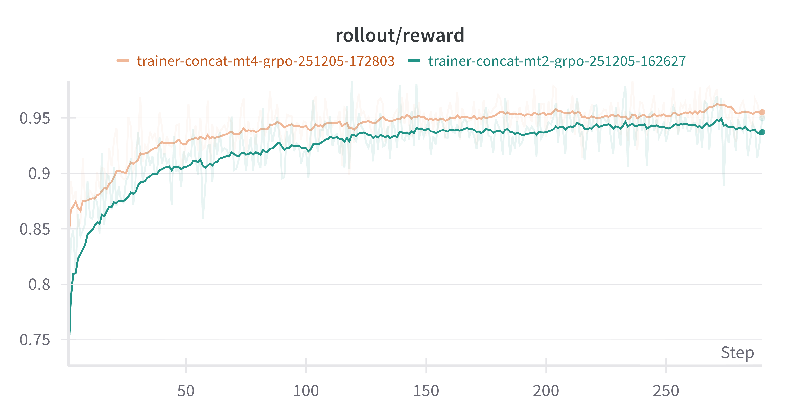

# Training a Multi-Turn GSM8K Math Agent in AReaL

Files in this folder presents an example that train a multi-turn GSM8K math agent from
Qwen/Qwen2.5-1.5B-Instruct, using `ArealOpenAI` APIs and its `concat` mode to organize
training data and discount reward.

# To run the example

```bash
cd aigise
pip install -e '.[langfuse]'

# follow areal installation guide

FLASHINFER_WORKSPACE_BASE=./flashinfer_cache AREAL_CACHE_DIR=./areal_cache python -m areal.launcher.local examples/aigise/aigise_rl_mt.py --config examples/aigise/aigise_grpo_mt.yaml experiment_name=aigise-grpo-multiturn trial_name=trial0
```

only the following config are added compared to the original `gsm8k_grpo.yaml` config:

```yaml
export_style: concat
agent_run_args:
  max_turns: 2
```

## Reward Curve


